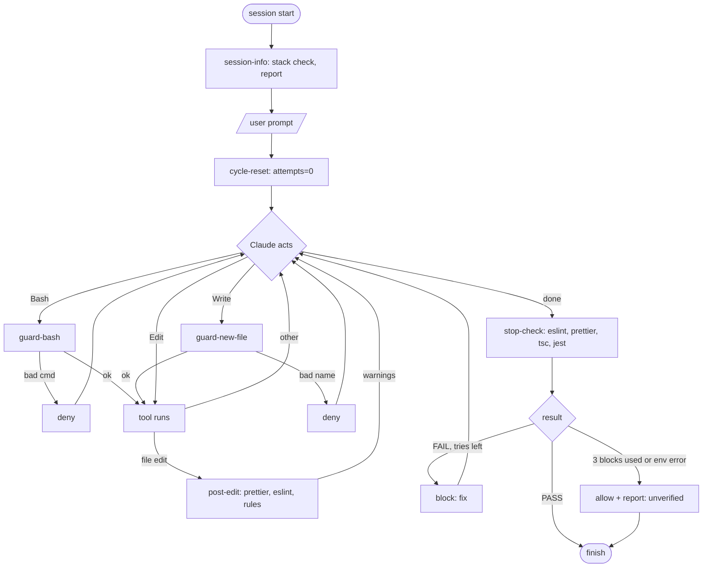

# Hook ideas

Status: `have` = exists. `todo` = build.

## Plan (decided by grill-me)

| Event | Matcher | Hook | Does | Status |
| --- | --- | --- | --- | --- |
| `Stop` | none | `lint-check.cjs` -> `stop-check.cjs` | Runs eslint, prettier, tsc, jest on changed files. FAIL: block (max 3 per cycle). ERROR or budget used: allow + report. Details: [Stop hook](#stop-hook). | have (1.1, 2, 3.1, 4.2 only) |
| `PostToolUse` | `Edit\|Write` | `post-edit.cjs` | One pipeline: prettier --write, then eslint and repo rules (routes, data-cy, design tokens, i18n, gherkin). Warns only, never blocks. Details: [post-edit hook](#post-edit-hook). | todo |
| `UserPromptSubmit` | none | `cycle-reset.cjs` | Set `attempts` = 0 in `dod-<session_id>.json` (new completion cycle starts each user prompt). No output. Uses `readInput()`, `loadState()` / `saveState()`. | todo |
| `PreToolUse` | `Bash` | `guard-bash.cjs` | Block `git commit --no-verify`, `git push --force`, `git reset --hard` / `git checkout -- .`, `rm -rf`. Exit 2 + reason (`deny()`). Uses `readInput()`. | todo |
| `PreToolUse` | `Write` | `guard-new-file.cjs` | Deny a new file in `service/`, `model/`, `core/` unless its stem is PascalCase. Details: [guard-new-file hook](#guard-new-file-hook). | todo |
| `SessionStart` | `startup\|resume` | `session-info.cjs` | One quick Docker + dev server check at start, report only. `--wait` retries on demand. Details: [session-info hook](#session-info-hook). | todo |

## Hook details

Long steps live here, the table above only summarizes.

How to read a step:

- Each numbered section (**1.**, **2.** ...) has a **Goal** and a **Result**.
- Each step inside (1.1, 1.2 ...) has **What** (the action), **Why** (the reason) and **How** (the concrete way).
- Numbers below a step (1.2.1, 2.1.1.1 ...) are details of its **How**. Numbers are stable references.

### Stop hook

Event `Stop`, no matcher. File `stop-check.cjs` (replaces `lint-check.cjs`). Outcomes: see "Stop outcomes". Status: have (1.1, 2, 3.1, 4.2 only).

**1. Input and state**

> **Goal:** Know the start commit of the session and how often this hook already blocked.
>
> **Result:** A loaded state object `{base, attempts, lastPassHash, lastFailures}` (defaults if the file is missing).

- **1.1 Read the hook input**
  - **What:** Read the JSON that Claude Code sends on stdin.
  - **Why:** It holds the `session_id` (name of the state file) and `stop_hook_active`.
  - **How:** `JSON.parse` of stdin, once (`lib/input.cjs`).
- **1.2 Load the state file**
  - **What:** Read the numbers saved by earlier Stops of this session.
  - **Why:** A hook starts from nothing on every run. It needs a memory to count blocks and to remember the last pass.
  - **How:** File `os.tmpdir()/dod-<session_id>.json` = `{base, attempts, lastPassHash, lastFailures}`. Keys (`lib/state.cjs` `loadState()` / `lib/state.cjs` `saveState()`):
    - 1.2.1 `base`: git commit hash (HEAD) at the first Stop of the session. Changed files (2.1) are compared against it.
    - 1.2.2 `attempts`: how often this hook blocked in the current cycle, 0 to 3. Cycle starts with your prompt (`cycle-reset.cjs` sets 0). Cycle ends when Claude may stop: PASS (8.1 sets 0) or UNRESOLVED (7.4, stays 3 until your next prompt).
    - 1.2.3 `lastPassHash`: fingerprint (hash of file list + file contents, see 3.2) of the last state where all checks passed. Same fingerprint again = nothing new to check.
    - 1.2.4 `lastFailures`: names of the tools that FAILED at the last block, e.g. `["eslint","jest"]`. Used in the final report (7.4).
    - 1.2.5 Why a file and not `stop_hook_active`: that input field is only true/false ("this turn was already blocked once"), it cannot count to 3.
- **1.3 Use defaults when there is no usable state**
  - **What:** Start from fixed values.
  - **Why:** The first Stop of a session has no file yet. A broken file must never crash the hook.
  - **How:** Missing, unreadable or invalid JSON: `{base: current HEAD, attempts: 0, lastPassHash: null, lastFailures: []}`. `null` never equals a fingerprint, so 3.2 does not skip and all checks run (`lib/git-changes.cjs` `getHead()` for the default `base`).

**2. Changed files**

> **Goal:** Find every file Claude touched since the session began.
>
> **Result:** One list of repo-relative paths: edited tracked files plus new untracked files, no deleted files.

- **2.1 Build the file list**
  - **What:** List all files changed in this session.
  - **Why:** The tools should check only what Claude touched. That is faster and avoids noise from old code.
  - **How:** Two git commands, then merge (`lib/git-changes.cjs` `getChangedFiles()`):
    - 2.1.1 `git diff --name-only --diff-filter=d <base>`: tracked files that differ from `<base>`.
      - 2.1.1.1 `git diff <base>`: commit `<base>` against the files on disk. Sees staged, unstaged and already committed changes (lesson "git diff: commit vs working tree").
      - 2.1.1.2 `--name-only`: print only the paths, one per line, not the changed lines.
      - 2.1.1.3 `--diff-filter=d`: lowercase `d` leaves out deleted files. A deleted file cannot be linted.
      - 2.1.1.4 A renamed file appears once, under its new name.
    - 2.1.2 `git ls-files -o --exclude-standard`: files Git does not track yet. `git diff` cannot see them.
      - 2.1.2.1 `-o` (`--others`): list untracked files.
      - 2.1.2.2 `--exclude-standard`: hide files matched by `.gitignore` (`node_modules`, `dist`, `coverage`).
      - 2.1.2.3 After `git add` a new file counts as tracked: it comes from 2.1.1, not from here.
    - 2.1.3 Merge: put the lists of 2.1.1 (edited tracked files) and 2.1.2 (new untracked files) into one list. Both are needed because `git diff` does not know new files. The lists do not overlap (a file is tracked or untracked). Removing duplicates (`new Set`) is only a cheap guard.
    - 2.1.4 Run both commands with the repo root as working directory (`$CLAUDE_PROJECT_DIR`), so both print paths relative to the same folder.
- **2.2 Compare against `base`, not against HEAD**
  - **What:** Use the start commit of the session as the reference.
  - **Why:** If Claude commits during the session, HEAD moves on. A diff against HEAD would forget those files and skip their checks.
  - **How:** Put `base` (1.2.1) into the command of 2.1.1.

**3. Gate (exit before running tools)**

> **Goal:** Skip the slow tools when there is nothing new to check.
>
> **Result:** Either an early `exit 0`, or a go-ahead with a fingerprint and a non-empty list `changedFiles` of `.ts/.html/.scss` files.

- **3.1 Filter by extension**
  - **What:** Keep only `.ts`, `.html` and `.scss` files. The result is the list `changedFiles`.
  - **Why:** Other files (md, json, images) have no check here.
  - **How:** Filter the list of 2.1.3 by file ending. Empty list: `exit 0`.
- **3.2 Compare the fingerprint**
  - **What:** Skip everything if exactly this state already passed.
  - **Why:** No repeated slow checks on unchanged code.
  - **How:** Fingerprint = hash of the file list + the file contents. Equal to `lastPassHash`: `exit 0` (`lib/state.cjs` `fingerprint()`).
- **3.3 A new fingerprint does not reset `attempts`**
  - **What:** Keep the block counter when files change.
  - **Why:** Otherwise every fix of Claude changes the files, restarts the count and the loop never ends.
  - **How:** Only `cycle-reset.cjs` (new prompt) and 8.1 (all pass) set `attempts` to 0.

**4. Run checks**

> **Goal:** Run eslint, prettier, tsc and jest on the changed files.
>
> **Result:** Per tool: exit code and output, or "skipped".

- **4.1 Start a tool**
  - **What:** One way to start every tool.
  - **Why:** No `npx` (slow start, may download). No shell (a file name with a space or `;` stays harmless).
  - **How:** `spawnSync(toolPath, [...options, ...files])` (`lib/run-command.cjs` `runTool()`):
    - 4.1.1 `toolPath`: `node_modules/.bin/<tool>`, the project's own copy of the tool.
    - 4.1.2 `options`: the flags of that tool, one string per flag. Defined in 4.2 to 4.5.
    - 4.1.3 `files`: the paths that tool must check, one string per path. Always taken from `changedFiles` (3.1), filtered per tool as in 4.2 to 4.5. Never typed by hand.
    - 4.1.4 `...` (spread) puts the entries of both lists into one list, so every flag and every path stays its own entry.
- **4.2 eslint**
  - **What:** Lint the changed `.ts` and `.html` files, errors only.
  - **Why:** About 600 old warnings exist, they must not block. Warnings on new code are reported by `post-edit` (5.1 there).
  - **How:** `options` = `['--quiet']`. `files` = `eslintFiles` = entries of `changedFiles` ending `.ts` or `.html` (`.eslintrc.json` has rules for `*.ts` and `*.html` only, a `.scss` path would fail). Skip if empty.
- **4.3 prettier**
  - **What:** Check the formatting of all changed files.
  - **Why:** `post-edit` formats only after the `Edit` and `Write` tools. A file changed through Bash (`sed -i`, `npm run lint:fix`) is never formatted by it. This check finds those files, because the list comes from `git diff`, not from the tool that changed them.
  - **How:** `options` = `['--check']`. `files` = `prettierFiles` = all of `changedFiles` (`.ts`, `.html`, `.scss`).
- **4.4 tsc**
  - **What:** Type-check the whole project.
  - **Why:** A change in one file can break the types in another. `tsc` does not check `.html` templates, so it only matters for `.ts` and tsconfig changes.
  - **How:** `options` = `['--noEmit', '-p', 'tsconfig.app.json']`. `files` = none (the tsconfig decides). Run only if a `.ts` file in `changedFiles` or a `tsconfig*.json` changed. Else skip.
- **4.5 jest**
  - **What:** Run the tests related to the changed `.ts` files.
  - **Why:** The CI does not run jest, so this hook is the only gate. The whole suite would be too slow.
  - **How:** `options` = `['--coverage=false', '--passWithNoTests', '--findRelatedTests']`. `files` = `jestFiles` = entries of `changedFiles` ending `.ts`, including `.spec.ts` (a changed spec runs itself). Flags BEFORE the file list: `--findRelatedTests` takes a list of files and swallows any flag after them. `--coverage=false` because `jest.config.js` forces coverage, which is slow. Skip if empty.

**5. Warn only (no block)**

> **Goal:** Remind about a missing spec for new logic files, without blocking.
>
> **Result:** Zero or more warning lines, added to the final message.

- **5.1 Find new logic files without a spec**
  - **What:** Warn if a new file has no sibling `.spec.ts`.
  - **Why:** Definition of done item 4: new logic gets a spec.
  - **How:** New = untracked or added vs `base`. Logic file = `*.service.ts`, `*.pipe.ts`, `*.guard.ts`, `*.interceptor.ts`, or a module function under `src/app/service/`. No `X.spec.ts` next to `X.ts`: add a warning line (`lib/git-changes.cjs` `isNewFile()`).
- **5.2 Limit the scope**
  - **What:** Ignore models, types, constants, barrels, modules, routes, and all old files.
  - **Why:** 206 of 208 old services have no spec. Warning about them would never stop.
  - **How:** Only new files, only the name patterns of 5.1.

**6. Classify each tool from 4.2 to 4.5**

> **Goal:** Separate code defects from environment problems.
>
> **Result:** Every tool labelled PASS, FAIL or ERROR.

- **6.1 PASS**
  - **What:** The tool is happy.
  - **Why:** Nothing to fix.
  - **How:** Exit code 0 (labels of 6.1 to 6.3: `lib/diagnostics.cjs` `classify()`).
- **6.2 FAIL (code defect)**
  - **What:** The tool found a problem in the code.
  - **Why:** Claude can fix it, so the hook may block.
  - **How:** eslint exit 1 with errors, prettier exit 1, tsc diagnostics, jest summary line `Tests:` with failures.
- **6.3 ERROR (environment)**
  - **What:** The tool could not do its job.
  - **Why:** Editing code does not help. Claude must not try to "fix" code for a broken setup.
  - **How:** Spawn error (ENOENT, timeout), eslint/prettier exit 2, tsc config error (`TS5xxx`), jest without a `Tests:` summary (config could not load, `Test suite failed to run`, `Validation Error`).
- **6.4 Known limit**
  - **What:** jest and tsc ERROR detection matches output text.
  - **Why:** New tool versions may change the wording.
  - **How:** ponytail: ceiling is the current wording, fix the patterns then.

**7. Decide and report**

> **Goal:** Choose block or allow, and tell Claude and Shah exactly why.
>
> **Result:** One output: a block with reason (REPAIRABLE), a `systemMessage` (UNRESOLVED or ERROR only), or a silent exit. State file updated.

- **7.1 Write one report line per tool**
  - **What:** Name every tool with its label.
  - **Why:** Claude and Shah see at once which tool passed, failed or broke.
  - **How:** `ESLint: FAIL (2 errors)`, `TypeScript: PASS`, `Jest: ERROR (config could not load)`, `Prettier: PASS` (`lib/diagnostics.cjs` `reportLine()`).
- **7.2 REPAIRABLE: block**
  - **What:** Stop Claude from finishing while something fails.
  - **Why:** Claude can fix a FAIL, and it still has tries left.
  - **How:** Any FAIL and `attempts` < 3: `attempts` +1, `lastFailures` = FAIL tool names, print `{"decision":"block","reason":"<report + output>"}`. Add the warnings of 5 (`lib/output.cjs` `blockStop()`).
- **7.3 Block 3 of 3: last attempt**
  - **What:** Tell Claude this is the last chance.
  - **Why:** Claude's last text is what Shah reads. A `systemMessage` alone is easy to miss.
  - **How:** Append to the reason: "Last attempt. If you cannot fix it, your final answer MUST say which checks still fail (<tools>) and that the work is NOT verified."
- **7.4 UNRESOLVED: allow, but say it**
  - **What:** Let Claude finish and report the failure.
  - **Why:** Endless blocking helps nobody. Exit 0 with no output would read as "verified".
  - **How:** Any FAIL and `attempts` >= 3: no block. Exit 0 with `{"systemMessage":"dod-check: still failing after 3 blocks: <lastFailures>"}`. Decided after the checks ran, so a state fixed in the meantime goes to 8, not here (`lib/output.cjs` `notify()`).
- **7.5 Trim the output**
  - **What:** Keep the start of each failing tool's output.
  - **Why:** The first error is usually the cause. A concatenated tail can cut it off.
  - **How:** Per FAIL tool the FIRST ~3000 chars, labelled by tool (`lib/diagnostics.cjs` `trimOutput()`).
- **7.6 ERROR only: do not block**
  - **What:** Report an environment problem without blocking.
  - **Why:** Claude would try to "fix" code that is not broken.
  - **How:** ERROR and no FAIL: no block, no attempt counted. Exit 0 with `systemMessage` "environment problem, not a code defect: <tool>: <reason>" (`lib/output.cjs` `notify()`).
- **7.7 Rule for a silent exit**
  - **What:** Exit 0 with no output only when "verified or nothing to verify".
  - **Why:** Silence must always mean "all good".
  - **How:** Allowed: 3.1 (no relevant files), 3.2 (fingerprint equals `lastPassHash`), or 8. Every other `exit 0` prints a `systemMessage`: budget exhausted (7.4), ERROR only (7.6), or a tool crashed (`lib/output.cjs` `allow()`).

**8. All pass**

> **Goal:** Remember the verified state.
>
> **Result:** `lastPassHash` set, `attempts` = 0, `lastFailures` = `[]`, silent `exit 0`.

- **8.1 Save the pass**
  - **What:** Store that this state passed.
  - **Why:** The next Stop with the same fingerprint can skip all checks (3.2). The block counter starts clean.
  - **How:** `lastPassHash` = fingerprint, `attempts` = 0, `lastFailures` = `[]`, exit 0, no output (or the warnings of 5 only) (`lib/state.cjs` `saveState()`, `lib/output.cjs` `allow()`).

### post-edit hook

Event `PostToolUse`, matcher `Edit|Write`. File `post-edit.cjs`. Status: todo.

ONE script, one pipeline. Two hooks on the same event would run in parallel, and format and lint must run in order.

**1. Input**

> **Goal:** Learn which file was just edited.
>
> **Result:** The `file_path` string.

- **1.1 Read the hook input**
  - **What:** Take `tool_input.file_path` from the JSON on stdin.
  - **Why:** It names the edited file.
  - **How:** `JSON.parse` of stdin, once (`lib/input.cjs`).

**2. Path**

> **Goal:** Decide if the edited file needs a check at all, and write its path in the form all rules expect.
>
> **Result:** Either an early `exit 0` (nothing to check: file outside the repo, in `node_modules`/`dist`/`coverage`, or already gone), or the repo-relative path, e.g. `src/app/Foo.service.ts`, passed on to step 3.

- **2.1 Normalize the path**
  - **What:** Make it absolute, then relative to the repo.
  - **Why:** The tool may send an absolute path. All rules use repo-relative paths.
  - **How:** `path.relative($CLAUDE_PROJECT_DIR, absolutePath)` (`lib/paths.cjs`).
- **2.2 Skip files this hook does not handle**
  - **What:** Exit for files outside the repo, under `node_modules`, `dist` or `coverage`, or missing files.
  - **Why:** There is nothing useful to check.
  - **How:** `exit 0`, no output (`lib/paths.cjs` `isIgnoredPath()`).

**3. File type**

> **Goal:** Choose which checks apply.
>
> **Result:** A type label (`ts`, `html`, `scss`, `i18n`, `feature`), or an early `exit 0`.

- **3.1 Detect the type**
  - **What:** Give the file a type label.
  - **Why:** Each type has its own checks.
  - **How:** From extension and path: `ts`, `html`, `scss`, `i18n` (`src/assets/i18n/*.json`), `feature` (`cypress/**/*.feature`). Other types: `exit 0`.

**4. Format**

> **Goal:** Format the edited file with prettier right after the edit. Claude then never has to care about code style, and the prettier check of the Stop hook has nothing left to fail on.
>
> **Result:** The file on disk is formatted. If prettier changed it, a note tells Claude to re-read the file before its next Edit.

- **4.1 Format the file**
  - **What:** Run prettier on the edited file.
  - **Why:** Later checks must see the final content. Formatting is not Claude's job.
  - **How:** `prettier --write` for the types ts, html, scss, json and feature, where prettier supports them (`lib/run-command.cjs` `runTool()`).
- **4.2 Report a rewrite**
  - **What:** Tell Claude when prettier changed the file.
  - **Why:** Claude must not work from stale content. Its next Edit would use the old text.
  - **How:** Compare the content before and after. Changed: add the note "prettier reformatted <file>, re-read before next Edit".

**5. Checks for that type**

> **Goal:** Find rule violations in the file without stopping at the first one.
>
> **Result:** A list of warning strings per check (can be empty). All checks run on the formatted file and collect their result, none throws.

- **5.1 eslint, warnings too**
  - **What:** Lint the file.
  - **Why:** CLAUDE.md rules (calls end in a const, typed arrow parameters, access modifiers) report as warnings. The Stop hook uses `--quiet` and would miss them.
  - **How:** Types `ts` and `html` (`lib/run-command.cjs` `runTool()`).
- **5.2 Route strings**
  - **What:** Find literal route paths.
  - **Why:** Paths belong in `src/app/app-paths.ts`, not in strings.
  - **How:** Types `ts` and `html`. Literal strings in `router.navigate*`, `routerLink`, `path:` that equal a value in `app-paths.ts`. Ignore `''`.
- **5.3 Raw `data-cy`**
  - **What:** Find `data-cy` written by hand.
  - **Why:** Templates must use the `numDataCy` directive.
  - **How:** Type `html`. `data-cy` or `[attr.data-cy]` on added lines only (8 old hits exist) (`lib/git-changes.cjs` `getAddedLines()`).
- **5.4 Design tokens**
  - **What:** Find hardcoded colors and spacing.
  - **Why:** The repo has tokens for them.
  - **How:** Types `html` and `scss`, added lines only (`lib/git-changes.cjs` `getAddedLines()`):
    - 5.4.1 Added lines = `git diff -U0`; an untracked file counts as all lines.
    - 5.4.2 Flag hardcoded hex/rgb colors and px spacing.
    - 5.4.3 Skip comment lines and token definitions (`--x:` / `$x:`). No CSS parser.
    - 5.4.4 Suggest `--color-*`, `--border-radius-*`, `$spacing-scale`.
- **5.5 Translation references**
  - **What:** Check that used translation keys exist.
  - **Why:** A missing key shows the raw key in the UI.
  - **How:** Types `html` and `ts`, added lines only (`lib/git-changes.cjs` `getAddedLines()`):
    - 5.5.1 Static key = string literal in single or double quotes (`'A.B' | translate`, `"A.B" | translate`, `translate.instant('A.B')`, `.get('A.B')`) or a backtick string without `${`. Check each in `de.json` and `en.json` separately: "missing in de: ..." / "missing in en: ...".
    - 5.5.2 Dynamic = template literal with `${}`, variable, concatenation, ternary (e.g. `` `ERROR.${error.code}` ``): cannot be checked, never flagged, only counted as "N dynamic refs not checked".
    - 5.5.3 `| displayTranslation` takes an object, not a key: ignore.
- **5.6 i18n parity**
  - **What:** Compare the keys of `de.json` and `en.json`.
  - **Why:** Both languages need the same keys.
  - **How:** Type `i18n`:
    - 5.6.1 Valid JSON, then compare the key sets. Report separately: "missing in de" (keys only in en) and "missing in en" (keys only in de).
    - 5.6.2 Baseline `.claude/hooks/i18n-baseline.json` lists 16 known discrepancies (12 missing in de, 4 missing in en), generated once from the current files. Report only discrepancies NOT in the baseline; report baseline entries now fixed ("remove from baseline").
    - 5.6.3 No unused-key check (dynamic keys).
- **5.7 Cypress feature files**
  - **What:** Check tags and step-file names.
  - **Why:** Untagged features are missing in the coverage report. A near-match step file is silently not loaded.
  - **How:** Type `feature`:
    - 5.7.1 Needs an `@area:<module>` or `@cross-cutting` tag.
    - 5.7.2 Warn if a `.ts` file in the same folder has a near-match basename.

**6. Aggregate**

> **Goal:** Give one readable summary.
>
> **Result:** One text, every line prefixed with file and check name, capped in size.

- **6.1 Merge the results**
  - **What:** One list of notes and warnings.
  - **Why:** Claude gets one message, not one per check.
  - **How:** Each line prefixed with file and check name.
- **6.2 Cap the size**
  - **What:** Limit each check.
  - **Why:** One noisy check must not hide the others.
  - **How:** About 3000 chars per check (`lib/diagnostics.cjs` `trimOutput()`).

**7. Return**

> **Goal:** Hand the summary to Claude.
>
> **Result:** JSON `additionalContext`, or no output. Always `exit 0`.

- **7.1 Return one response**
  - **What:** Send the summary to Claude.
  - **Why:** `additionalContext` is added to Claude's context after the edit.
  - **How:** `{"hookSpecificOutput":{"hookEventName":"PostToolUse","additionalContext":"<list>"}}`. Nothing to say: no output (`lib/output.cjs` `addContext()`).
- **7.2 Never block**
  - **What:** Always `exit 0`.
  - **Why:** The edit already happened. This hook only informs.
  - **How:** No `decision` field in the output.

### guard-new-file hook

Event `PreToolUse`, matcher `Write`. File `guard-new-file.cjs`. Status: todo.

**1. Input**

> **Goal:** Learn which file Claude wants to create.
>
> **Result:** The `file_path` string.

- **1.1 Read the hook input**
  - **What:** Take `tool_input.file_path`.
  - **Why:** It names the file about to be written.
  - **How:** `JSON.parse` of stdin (`lib/input.cjs`).

**2. Path**

> **Goal:** Get the real location inside the repo.
>
> **Result:** A normalized absolute path, or an early `exit 0` if outside the repo.

- **2.1 Resolve the path**
  - **What:** Make the path absolute.
  - **Why:** The tool may send a relative path.
  - **How:** `path.resolve` against `$CLAUDE_PROJECT_DIR` (steps 2.1 to 2.3 together: `lib/paths.cjs` `toRepoPath()`).
- **2.2 Resolve symlinks**
  - **What:** Find the real folder.
  - **Why:** A symlink must not hide a file outside the watched folders.
  - **How:** `realpath` of the nearest existing parent folder.
- **2.3 Ignore files outside the repo**
  - **What:** Exit for paths outside the repo.
  - **Why:** Not this repo's rules.
  - **How:** The relative path starts with `..`: `exit 0`.

**3. Scope**

> **Goal:** Judge only files in the three watched folders.
>
> **Result:** Continue, or `exit 0`.

- **3.1 Check the folder**
  - **What:** Only `.ts` files under `src/app/service/`, `src/app/model/`, `src/app/core/`.
  - **Why:** That is where CLAUDE.md demands PascalCase names.
  - **How:** Path prefix and `.ts` ending. Else `exit 0`.

**4. Create vs overwrite**

> **Goal:** Judge only new files, never rewrites.
>
> **Result:** Continue (file is new) or `exit 0` (file exists).

- **4.1 Allow rewrites**
  - **What:** An existing file passes.
  - **Why:** Legacy kebab-case files may be rewritten.
  - **How:** File exists: `exit 0`.
- **4.2 Check only new files**
  - **What:** Continue only when the file does not exist yet.
  - **Why:** Only new files can get a wrong name.
  - **How:** File does not exist: go to 5.

**5. Nested dirs**

> **Goal:** Decide what to check at deeper folder levels.
>
> **Result:** The file stem and any new `service/` folder names go to the name rule.

- **5.1 Any depth**
  - **What:** The rule covers every depth under the three folders.
  - **Why:** Files are nested (`service/Criterion/...`).
  - **How:** Prefix check of 3.1 only.
- **5.2 Check stem and new folders**
  - **What:** Check the file stem, and new folder names under `service/`.
  - **Why:** CLAUDE.md: PascalCase subfolders there.
  - **How:** Folder segments in the path that do not exist yet.
- **5.3 Leave existing folders alone**
  - **What:** Do not judge folders that already exist.
  - **Why:** They are legacy and not part of this task.
  - **How:** Skip segments that exist on disk.

**6. Name rule**

> **Goal:** Test the names.
>
> **Result:** Pass, or a violation with the offending name.

- **6.1 Test the stem**
  - **What:** The stem is the file name up to the FIRST dot.
  - **Why:** The part after it is the Angular suffix, not the name.
  - **How:** Must match `^[A-Z][A-Za-z0-9]*$`.
- **6.2 Free suffixes**
  - **What:** Everything after the first dot is free.
  - **Why:** `.service`, `.model`, `.spec`, `.cases`, `.fixtures`, `.d` are normal.
  - **How:** `Foo.service.ts`, `Foo.spec.ts`, `Foo.d.ts` pass; `foo-bar.service.ts` fails.
- **6.3 `index.ts` passes**
  - **What:** Barrel files are allowed.
  - **Why:** The name `index` is a convention.
  - **How:** Explicit exception.

**7. Fail**

> **Goal:** Stop a wrongly named file and say how to fix it.
>
> **Result:** `exit 2` plus a stderr message with a suggested name. The Write is denied.

- **7.1 Deny**
  - **What:** Block the Write.
  - **Why:** Exit code 2 of a `PreToolUse` hook denies the tool call.
  - **How:** `exit 2` (`lib/output.cjs` `deny()`).
- **7.2 Suggest a name**
  - **What:** Tell Claude the right name.
  - **Why:** Claude can retry at once.
  - **How:** stderr names the file and a suggestion (`foo-bar.service.ts` -> `FooBar.service.ts`).

**8. Known gap**

> **Goal:** Be honest about what is not covered.
>
> **Result:** A written limit: files created through Bash are not checked.

- **8.1 Bash is not covered**
  - **What:** Only the `Write` tool is checked.
  - **Why:** `touch`, `git mv`, `cp` create files without it.
  - **How:** ponytail: add a `Bash` matcher if it ever happens.

### session-info hook

Event `SessionStart`, matcher `startup|resume`. File `session-info.cjs`. Status: todo.

**1. Quick check (no retry, no background)**

> **Goal:** Learn the state of the local stack in about 4 s.
>
> **Result:** Raw status of the Docker containers and the dev server.

- **1.1 Ask Docker and the dev server**
  - **What:** One status call each.
  - **Why:** A slow start of the session is worse than a missing check.
  - **How:** `docker ps -a` (timeout 3 s) and `curl --max-time 1 :4200` (`lib/run-command.cjs` `run()`).
- **1.2 Bound the time**
  - **What:** Fixed upper limit.
  - **Why:** The session start must not hang.
  - **How:** Worst case about 4 s, no retry.

**2. What is checked**

> **Goal:** Define what "healthy" means.
>
> **Result:** Six checks, each up or down.

- **2.1 The list**
  - **What:** Six things.
  - **Why:** The app needs all of them to start fully.
  - **How:** Dev server, `dataportal-backend` healthy, `keycloak-auth` up, `dataportal-postgres` up, `dataportal-elastic` healthy, `elastic-search-init` Exited (0).

**3. Report**

> **Goal:** Tell Claude what works and what does not.
>
> **Result:** `additionalContext` text: one line if all is up, otherwise the full list plus a consequence line.

- **3.1 Never block**
  - **What:** Always `exit 0`, output as `additionalContext`.
  - **Why:** A down stack is information, not an error. Frontend work can go on.
  - **How:** `hookSpecificOutput.additionalContext` (`lib/output.cjs` `addContext()`).
- **3.2 All fine**
  - **What:** One short line.
  - **Why:** No noise.
  - **How:** "Local stack: all up".
- **3.3 Something off**
  - **What:** Full list plus what it means for the work.
  - **Why:** Claude knows what may fail.
  - **How:**
    - 3.3.1 `Local environment:` / `- Angular dev server: available` / `- Backend: unavailable` / `- Keycloak: running` / `- PostgreSQL: healthy` / `- Elasticsearch: healthy (init finished)`
    - 3.3.2 `Frontend-only work can proceed. Backend-dependent tests may fail.`

**4. Docker missing or daemon down**

> **Goal:** Avoid noise when Docker is not there.
>
> **Result:** One line, no per-service lines.

- **4.1 One line**
  - **What:** Say Docker is unavailable.
  - **Why:** Six "down" lines would add nothing.
  - **How:** "Docker unavailable, backend-dependent work will fail".
- **4.2 No per-service lines**
  - **What:** Skip the list.
  - **Why:** It is implied.
  - **How:** Return right after 4.1.

**5. Retry only on demand**

> **Goal:** Wait for services only when the task needs them.
>
> **Result:** A `--wait` run that reports after up to 10 tries.

- **5.1 `--wait` mode**
  - **What:** The same file, run by hand.
  - **Why:** Services may still be starting.
  - **How:** `node .claude/hooks/session-info.cjs --wait`: 10 tries, 3 s apart, then report.
- **5.2 Point to it**
  - **What:** Mention the command in the report.
  - **Why:** Claude finds it when needed.
  - **How:** When something is off: "Before backend, e2e or browser work run `node .claude/hooks/session-info.cjs --wait`".
- **5.3 Only when needed**
  - **What:** Claude runs it on demand only.
  - **Why:** Pure frontend work needs no wait.
  - **How:** Claude's decision per task.

## Workflow



## Stop outcomes (contract for `stop-check.cjs`)

Every run ends in exactly one of three outcomes. Sections 3 to 8 of the [Stop hook](#stop-hook) implement this (decision in 7.2, 7.4, 7.6, 8.1).

| Outcome | When | Hook does | Claude |
|---|---|---|---|
| PASS | All required checks PASS, or nothing to verify (no relevant files, fingerprint equals `lastPassHash`). | Exit 0, no output. `attempts` = 0, `lastFailures` = []. | Finishes. |
| REPAIRABLE | At least one tool FAIL (code defect) and `attempts` < 3. Tool in ERROR at same time listed as environment, not defect. | `attempts` +1. `{"decision":"block","reason":...}` with per-tool diagnostics (first ~3000 chars each). Block 3 of 3 adds "Last attempt, final answer MUST say what still fails". | Must fix and retry. |
| UNRESOLVED | `attempts` >= 3, or only ERROR tools (environment broken, config cannot load, timeout, tool crash). | Exit 0 (allow), never block. `systemMessage` lists failed or errored tools. `lastFailures` stays in state file. Environment case says "not a code defect". | Finishes. Shah sees message, so answer not mistaken for verified. |

Silent exit 0 only allowed for PASS.

## File layout

One entry file per hook, shared code in `lib/`, one module per `post-edit` rule. Node built-ins only, plain `.cjs`, no build step.

```
.claude/
├── settings.local.json
└── hooks/
    ├── stop-check.cjs        Stop                (was lint-check.cjs / dod-check)
    ├── cycle-reset.cjs       UserPromptSubmit    (sets attempts = 0)
    ├── post-edit.cjs         PostToolUse         (dispatcher)
    ├── guard-bash.cjs        PreToolUse Bash
    ├── guard-new-file.cjs    PreToolUse Write
    ├── session-info.cjs      SessionStart (+ --wait)
    ├── test/
    │   └── hooks.test.cjs    one `node --test` file, sample hook JSON in, assert exit code / output
    └── lib/
        ├── input.cjs         read stdin JSON once              (all)
        ├── paths.cjs         normalize + repo-relative + realpath (post-edit, guard-new-file)
        ├── git-changes.cjs   changed files vs base, added lines (stop-check, post-edit)
        ├── run-command.cjs   spawnSync(toolPath, [...options, ...files]), timeout (stop-check, post-edit, session-info)
        ├── diagnostics.cjs   PASS/FAIL/ERROR classify, per-tool truncation, report lines (stop-check, post-edit)
        ├── state.cjs         dod-<session_id>.json read/write (stop-check, cycle-reset)
        ├── output.cjs        print JSON + exit code: allow, addContext, blockStop, notify, deny (all)
        └── rules/            each exports check({ relPath, type, content, addedLines }) -> string[] warnings
            ├── design-tokens.cjs
            ├── i18n.cjs        (+ i18n-baseline.json)
            ├── routes.cjs
            ├── data-cy.cjs
            └── gherkin.cjs
```

- ONE project Stop hook: `stop-check.cjs` runs eslint, prettier, tsc, jest itself, then makes single block/allow decision, owns only retry state. Never wire second blocking Stop hook. `lint-check.cjs` deleted when `stop-check.cjs` lands (not wired today, only described in comment).
- Global `~/.claude/settings.json` already has Stop hook (handoff reminder after 45 min). Only prints `systemMessage`, never blocks, so no competition with `stop-check.cjs`. Its PostToolUse hook only opens plan files in VS Code (`Write`, `~/.claude/plans/*.md`), so no race with `post-edit.cjs`.
- `post-edit.cjs` holds table `file type -> [rules]`, calls them in order. New rule = one file + one table line.
- Pasted tree had no `cycle-reset.cjs` (UserPromptSubmit hook). Added.
- Build order: `lib/` core (input, paths, run-command) first, then `stop-check`, then `post-edit` one rule at a time.

## Shared code (lib API)

Repeated work lives once in `lib/`. Hooks `require` these functions (same process, no extra Node start). Steps in "Hook details" point to them as (`lib/<file>` `function()`).

| File | Function | Input -> Output | Used by |
|---|---|---|---|
| `lib/input.cjs` | `readInput()` | stdin JSON -> object (`{}` if empty or invalid) | all 6 entry hooks |
| `lib/paths.cjs` | `toRepoPath(filePath)` | any path -> repo-relative path, or `null` if outside the repo (resolve against `$CLAUDE_PROJECT_DIR`, `realpath` of the nearest existing parent) | post-edit, guard-new-file |
| `lib/paths.cjs` | `isIgnoredPath(relPath)` | path -> `true` if under `node_modules`, `dist`, `coverage` | post-edit |
| `lib/run-command.cjs` | `run(command, argumentList, timeoutMs)` | -> `{status, stdout, stderr, error}`; `spawnSync`, no shell, working directory = repo root, large `maxBuffer` | stop-check, post-edit, session-info |
| `lib/run-command.cjs` | `runTool(name, options, files)` | `run('node_modules/.bin/<name>', [...options, ...files])` | stop-check, post-edit |
| `lib/git-changes.cjs` | `getHead()` | -> commit hash (`git rev-parse HEAD`) | stop-check |
| `lib/git-changes.cjs` | `getChangedFiles(base)` | -> merged list of Stop 2.1.3 (diff + untracked) | stop-check |
| `lib/git-changes.cjs` | `getAddedLines(relPath)` | -> `[{lineNumber, text}]` from `git diff -U0`; untracked file = all lines | post-edit rules |
| `lib/git-changes.cjs` | `isNewFile(relPath, base)` | -> `true` if untracked or added vs `base` | stop-check (5.1) |
| `lib/diagnostics.cjs` | `classify(tool, result)` | -> `'PASS'`, `'FAIL'` or `'ERROR'` (rules of Stop 6) | stop-check |
| `lib/diagnostics.cjs` | `reportLine(label, status, detail)` | -> `ESLint: FAIL (2 errors)` | stop-check |
| `lib/diagnostics.cjs` | `trimOutput(text, maxChars = 3000)` | -> first `maxChars` characters | stop-check, post-edit |
| `lib/state.cjs` | `loadState(sessionId)` and `saveState(sessionId, state)` | file `dod-<session_id>.json`, defaults per Stop 1.3 | stop-check, cycle-reset |
| `lib/state.cjs` | `fingerprint(files)` | -> hash of the file list + file contents | stop-check |
| `lib/output.cjs` | `allow()` | silent `exit 0` | all |
| `lib/output.cjs` | `addContext(eventName, text)` | prints `hookSpecificOutput.additionalContext`, `exit 0` | post-edit, session-info |
| `lib/output.cjs` | `blockStop(reason)` | prints `{"decision":"block","reason":...}`, `exit 0` | stop-check |
| `lib/output.cjs` | `notify(text)` | prints `{"systemMessage":...}`, `exit 0` | stop-check |
| `lib/output.cjs` | `deny(reason)` | writes `reason` to stderr, `exit 2` | guard-bash, guard-new-file |

Rule modules in `lib/rules/*.cjs` have one interface: `check({ relPath, type, content, addedLines }) -> string[]` (warning lines, empty = fine).

## Wiring

All hooks go in `.claude/settings.local.json` (personal, not committed) under `hooks`. Command: `node "$CLAUDE_PROJECT_DIR/.claude/hooks/<name>.cjs"`.

## Open

- DECIDED: `post-edit` does not persist info (edited file, type, checks) for the Stop hook. Stop gets its file list from `git diff` (also covers Bash edits) and has its own fingerprint cache (3.2). Shared state between the two hooks would add a race for little gain.

- DECIDED: `dod-check` blocks max n=3 times per completion cycle (user prompt to user prompt), then lets Claude stop with final failure report (`systemMessage`). n=3 is "for now".

## All hooks Claude provides

| Event | When it fires |
| --- | --- |
| `SessionStart` | Session begins or resumes |
| `Setup` | `--init-only`, or `--init` / `--maintenance` in `-p` mode. One-time prep in CI or scripts |
| `UserPromptSubmit` | Prompt submitted, before Claude processes. Also on turns Claude starts itself |
| `UserPromptExpansion` | User-typed command expands into prompt. Can block |
| `PreToolUse` | Before tool call. Can block |
| `PermissionRequest` | Tool call needs permission decision |
| `PermissionDenied` | Auto mode denies tool call. `hookSpecificOutput.retry: true` lets model retry (ignored without classifier verdict) |
| `PostToolUse` | After tool call succeeds |
| `PostToolUseFailure` | After tool call fails |
| `PostToolBatch` | After full batch of parallel tool calls, before next model call |
| `Notification` | Claude Code sends notification |
| `MessageDisplay` | While assistant message text displayed |
| `SubagentStart` | Subagent spawned |
| `SubagentStop` | Subagent finishes |
| `TaskCreated` | Task created via `TaskCreate` |
| `TaskCompleted` | Task marked completed |
| `Stop` | Claude finishes responding |
| `StopFailure` | Turn ends from API error |
| `TeammateIdle` | Agent-team teammate about to go idle |
| `InstructionsLoaded` | `CLAUDE.md` or `.claude/rules/*.md` loaded into context (start, or lazy) |
| `ConfigChange` | Config file changes during session |
| `CwdChanged` | Working directory changes (e.g. `cd`). Good for direnv |
| `DirectoryAdded` | Directory added via `/add-dir` or SDK `register_repo_root` |
| `FileChanged` | Watched file changes on disk. `matcher` = filenames |
| `WorktreeCreate` | Worktree created (`--worktree`, `isolation: "worktree"`, background session). Replaces default git behavior |
| `WorktreeRemove` | Worktree made by `WorktreeCreate` hook removed |
| `PreCompact` | Before context compaction |
| `PostCompact` | After context compaction |
| `PreModelSwitch` | Before model switch you or client requested. Can block |
| `PostModelSwitch` | After session model changes, also self-made (e.g. restore on resume) |
| `Elicitation` | MCP server asks user for input during tool call |
| `ElicitationResult` | After user answers MCP elicitation, before reply goes to server |
| `SessionEnd` | Session terminates |