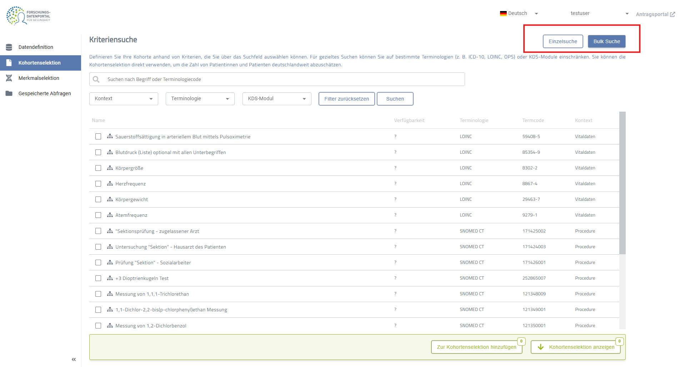

# Feasibility Query Usage

Text here basic description what feasibility query usage is about.

## Search

### Standard

Text needed
### Bulk

Bulk Search allows you to search for multiple codes or terms at once. Instead of selecting individual criteria from the results list one by one, you can paste or enter multiple search terms, and the system will resolve all matching entries at once.

## Edit

In the **Edit** view, you can modify each criterion using the options button on its card. Clicking this button opens a menu that allows you to edit the selected criterion. Depending on the type of criterion, it may support

### Time Restrictions

### Quantity

### Reference

### Concept

Text needed
## Result

### Details View
